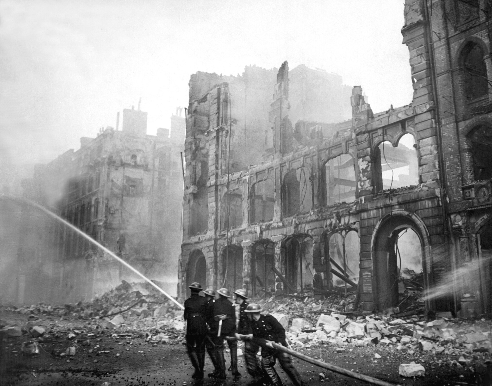

# Air Raids on Britain in World War II

During World War II, Germany conducted an extensive strategic bombing campaign against Britain, most notably [The Blitz](https://en.wikipedia.org/wiki/The_Blitz), which usually refers to the intensive bombing of London from 1940-1941. However, this bombing occurred throughout the war, including the late-war use of ballistic missiles ([V-weapons]([https://en.wikipedia.org/wiki/V-weapons#Use_against_Britain_and_Europe_1944%E2%80%9345](https://en.wikipedia.org/wiki/V-weapons#Use_against_Britain_and_Europe_1944–45))) in 1944-1945, which were used for "terror bombing", the specific targeting of civilians to instill widespread fear and weaken morale.

This data contains records of over 30,000 individual bombing incidents as well as the casualties associated with them: approximately 66,000 killed and 220,000 injured.

It's important to note that behind these figures are human lives. The primary source documents for this data -- [HO 203](https://discovery.nationalarchives.gov.uk/details/r/C9067) daily intelligence reports -- often contain free text descriptions that give us a glimpse into the humanity that these numbers represent. For example, this description accompanies a report of a bombing in Newcastle:

> At 2015 \[8:15 p.m.\] the ground collapsed in Tarset Street in the BYKER District of NEWCASTLE near a house bombed on the 6th. A boy attempted to rescue a little girl who had fallen into the hole, but was overcome by fumes. A further rescue attempt was made by two A.F.S. \[Auxiliary Fire Service\] men, but with a similar result. The four bodies were later recovered by a third man. No coal gas was present, and it is believed that the gas was carbon monoxide resulting from a bomb explosion.

(Excerpt is from the [article](http://www.warstateandsociety.com/Bombing-Britain) that accompanies the dataset)

Data is from the [Bombing Britain](http://www.warstateandsociety.com/Bombing-Britain) project from [War, State and Society](http://www.warstateandsociety.com/The-Collection/Overview), a collection of British World War II government files that seeks to "provide a uniquely comprehensive insight into the social, economic, political, and cultural affairs of wartime Britain, and a valuable snapshot of day to day life in every corner of the country and beyond." (The collection is geared towards researchers and requires a subscription, but the Bombing Britain dataset is freely available.)

# Data Dictionary

Data is separated into two tables. `bombings` describes individual bombing incidents and `casualties` describes the casualties associated with those incidents. A single record in `casualties` sometimes applies to multiple bombing records in `bombings`, typically when separate bombing locations are reported, but overall casualties are reported in aggregate. This happens frequently for London-area bombings. You can link the two tables using the `casualty_group` field, but be careful not to double-count casualty figures.

### `bombings.csv`

| variable             | class     | description                                                  |
| :------------------- | :-------- | :----------------------------------------------------------- |
| bombing_id | double | Unique identifier |
| civil_defence_region | character | Civil Defence Region (U.K. was divided into 13 regions, including Northern Ireland) |
| country | character | Country |
| location | character | Location (ranges from very general to very specific) |
| lon | double | Longitude coordinate (decimal) |
| lat | double | Latitude coordinate (decimal) |
| start_date | date | Start date of bombing |
| end_date | date | End date of bombing |
| time | character | Time of day of bombing (Day = 6am-6pm \| Night = 6pm-6am) |
| additional_notes | character | Additional notes on the bombing (e.g., bomb type, aggregation of casualty figures) |
| casualty_group | double | Linked to `casualties` data. Records in `bombings` with the same `casualty_group` number represented aggregated casualty data, but specific bombing location data. |

### `casualties.csv`

| variable         | class  | description                                                  |
| :--------------- | :----- | :----------------------------------------------------------- |
| casualty_group   | double | Linked to `bombings` data. Records in `bombings` with the same `casualty_group` number represented aggregated casualty data, but specific bombing location data. |
| killed           | double | Number of people killed                                      |
| injured          | double | Number of people injured                                     |
| total_casualties | double | Number of killed plus injured                                |